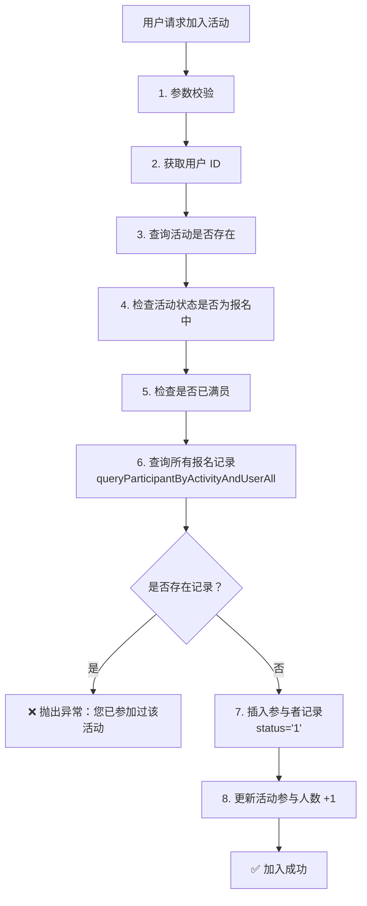

# 加入志愿活动并发问题修复说明

## 🐛 问题描述

### 错误信息
```
java.sql.SQLIntegrityConstraintViolationException: Duplicate entry '1-5' for key 'activity_participant.uk_activity_user'
```

### 错误场景
用户 ID=5 尝试再次报名活动 ID=1，但该用户之前已经报名过该活动（可能已取消）。

### 根本原因
**竞态条件导致的并发问题：**

1. **原查询逻辑缺陷**：
   - `queryParticipantByActivityAndUser()` 只查询 `status = '1'` 的记录
   - 如果用户之前报名后取消（`status = '0'`），该查询返回 null
   - 系统误认为用户未报名，允许再次插入
   
2. **并发场景下的问题**：
   ```
   线程 A: 查询用户是否报名 → 返回 null（因为之前取消过）
   线程 B: 查询用户是否报名 → 返回 null（因为之前取消过）
   线程 A: 插入参与者记录 → 成功
   线程 B: 插入参与者记录 → ❌ 失败！违反唯一索引 uk_activity_user
   ```

3. **数据库约束**：
   ```sql
   UNIQUE KEY `uk_activity_user` (`activity_id`, `user_id`)
   ```
   同一个用户对同一个活动只能有一条记录（无论状态如何）

## ✅ 解决方案

### 修复策略
**修改查询方法**：从 `queryParticipantByActivityAndUser()` 改为 `queryParticipantByActivityAndUserAll()`

### 代码变更

#### 修改前
```java
// 6. 检查用户是否已报名
ActivityParticipant existingParticipant = volunteerActivityMapper.queryParticipantByActivityAndUser(id, userId);
if (existingParticipant != null) {
    throw new CommonException("您已参加过该活动");
}
```

**问题**：
- `queryParticipantByActivityAndUser()` 的 SQL：
  ```sql
  SELECT * FROM activity_participant 
  WHERE activity_id = #{activityId} 
    AND user_id = #{userId} 
    AND status = '1'  -- ❌ 只查正常参与的
  ```
- 如果用户之前取消过（status='0'），查询返回 null
- 导致系统允许重复插入

#### 修改后
```java
// 6. 检查用户是否已报名（查询所有状态的记录，包括已取消的）
ActivityParticipant existingParticipant = volunteerActivityMapper.queryParticipantByActivityAndUserAll(id, userId);
if (existingParticipant != null) {
    // 如果已存在记录（无论是否取消过），都不允许再次报名
    throw new CommonException("您已参加过该活动");
}
```

**优势**：
- `queryParticipantByActivityAndUserAll()` 的 SQL：
  ```sql
  SELECT * FROM activity_participant 
  WHERE activity_id = #{activityId} 
    AND user_id = #{userId}  -- ✅ 不限制 status，查询所有记录
  ```
- 无论用户之前的记录是什么状态（正常、取消、删除），都能查询到
- 有效防止重复报名

## 🔍 对比分析

### 两个查询方法的区别

| 方法名 | SQL 条件 | 用途 | 适用场景 |
|--------|---------|------|---------|
| `queryParticipantByActivityAndUser()` | `status = '1'` | 查询正常参与的记录 | 查询我的活动时 |
| `queryParticipantByActivityAndUserAll()` | 无 status 限制 | 查询所有状态的记录 | 防重复报名、取消活动时 |

### 使用建议

**使用 `queryParticipantByActivityAndUserAll()` 的场景：**
1. ✅ 加入活动时防重复检查
2. ✅ 取消活动时查询参与记录
3. ✅ 需要知道用户是否有过报名记录的场景

**使用 `queryParticipantByActivityAndUser()` 的场景：**
1. ✅ 查询用户当前正常参与的活动
2. ✅ 统计用户实际参与的活动数量
3. ⚠️ **注意**：不能用于防重复检查！

## 🎯 业务逻辑优化

### 加入活动的完整校验流程（修复后）



### 关键点说明

**步骤 6 的重要性：**
- 必须查询**所有状态**的记录
- 包括：正常参与（status='1'）、已取消（status='0'）、已删除（status='-1'）
- 原因：数据库唯一索引 `uk_activity_user` 限制同一用户对同一活动只能有一条记录

## 📊 测试验证

### 测试场景 1：用户首次报名
```bash
# 场景：用户 ID=5 第一次报名活动 ID=1
curl -X POST http://localhost:port/volunteerActivity/normalVolunteer/joinActivity?id=1

# 预期结果：
# ✅ 报名成功
# 数据库：activity_participant 表新增一条记录 (activity_id=1, user_id=5, status='1')
```

### 测试场景 2：用户重复报名
```bash
# 场景：用户 ID=5 已经报名了活动 ID=1（status='1'）
curl -X POST http://localhost:port/volunteerActivity/normalVolunteer/joinActivity?id=1

# 预期结果：
# ❌ 报错："您已参加过该活动"
# 数据库：无变化
```

### 测试场景 3：用户取消后再次报名（关键场景）
```bash
# 前置条件：
# 1. 用户 ID=5 报名了活动 ID=1
# 2. 用户取消了该活动（status 变为 '0'）

# 场景：用户 ID=5 再次报名活动 ID=1
curl -X POST http://localhost:port/volunteerActivity/normalVolunteer/joinActivity?id=1

# 预期结果：
# ❌ 报错："您已参加过该活动"
# 数据库：无变化
# 
# ✅ 修复前：会报数据库唯一索引冲突错误
# ✅ 修复后：友好提示"您已参加过该活动"
```

### 测试场景 4：并发报名（极端场景）
```bash
# 场景：用户 ID=5 同时发起两次报名请求（模拟并发）
curl -X POST http://localhost:port/volunteerActivity/normalVolunteer/joinActivity?id=1 &
curl -X POST http://localhost:port/volunteerActivity/normalVolunteer/joinActivity?id=1 &

# 预期结果：
# 第一个请求：✅ 成功
# 第二个请求：❌ 报错："您已参加过该活动"
# 数据库：只有一条记录
```

## 🛡️ 防御性编程原则

### 1. 应用层 + 数据库层双重保障

**应用层防护：**
```java
// 查询所有状态的记录
ActivityParticipant existing = mapper.queryParticipantByActivityAndUserAll(id, userId);
if (existing != null) {
    throw new CommonException("您已参加过该活动");
}
```

**数据库层防护：**
```sql
UNIQUE KEY `uk_activity_user` (`activity_id`, `user_id`)
```

### 2. 宁可误杀，不可放过

**策略：**
- 只要用户有过报名记录（无论什么状态），就不允许再次报名
- 如果需要重新报名功能，应该：
  1. 先恢复原有记录的状态（status='1'）
  2. 而不是创建新记录

### 3. 明确的错误提示

**好的错误提示：**
```
"您已参加过该活动"
```

**不好的错误提示：**
```
"Duplicate entry '1-5' for key 'activity_participant.uk_activity_user'"
```

## 📝 经验总结

### 教训
1. ⚠️ **不要假设数据状态**：用户可能报名后取消，取消后不能再报名
2. ⚠️ **查询条件要谨慎**：带 status 条件的查询不能用于防重复检查
3. ⚠️ **并发思维**：即使有应用层检查，也要考虑并发场景

### 最佳实践
1. ✅ **防重复检查要查询所有状态**
2. ✅ **数据库唯一索引是最后一道防线**
3. ✅ **错误提示要友好且明确**
4. ✅ **代码审查时重点关注并发问题**

## 🔧 相关代码文件

### 修改的文件
- `VolunteerActivityServiceImpl.java` - 修复 joinActivity() 方法的查询逻辑

### 涉及的方法
- `queryParticipantByActivityAndUserAll()` - 查询所有状态的记录（✅ 推荐使用）
- ~~`queryParticipantByActivityAndUser()`~~ - 只查询正常参与的记录（⚠️ 不能用于防重复）

### 数据库表
- `activity_participant` - 志愿活动参与者表
  - 唯一索引：`uk_activity_user(activity_id, user_id)`
  - 状态字段：`status` ('1'-正常，'0'-取消，'-1'-删除)

## 📚 参考文档

- 《加入志愿活动功能实现方案》：`openspec/volunteer-activity-join-spec.md`
- 《防重复报名需应用层 + 数据库唯一索引双重保障》- 项目记忆
- 《加入志愿活动 Service 层 8 步校验与执行流程》- 项目记忆

---

**修复时间**: 2026-03-07  
**修复状态**: ✅ 完成  
**影响范围**: joinActivity() 方法  
**向后兼容**: ✅ 完全兼容
