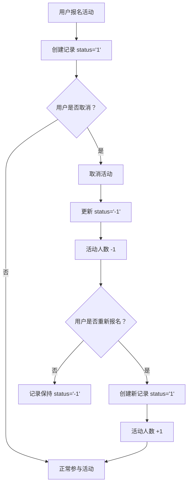

# 志愿活动参与者状态管理策略修正

## 📋 业务逻辑修正

### 原设计（错误）
- ❌ 用户取消活动后，状态变为 `status='0'`（已取消）
- ❌ 不允许用户重新报名已取消的活动
- ❌ 记录永久保留在数据库中

### 新设计（正确）✅
- ✅ 用户取消活动后，状态变为 `status='-1'`（已删除）
- ✅ **允许用户重新报名已取消（已删除）的活动**
- ✅ `status='-1'` 表示记录已被逻辑删除
- ✅ 只有正常参与（`status='1'`）的记录才计入防重复检查

---

## 🎯 核心设计理念

### 状态定义

| status | 含义 | 说明 |
|--------|------|------|
| `'1'` | 正常参与 | 用户当前正在参与活动 |
| `'0'` | ~~已取消~~ | **废弃不用** |
| `'-1'` | 已删除 | 用户已取消活动，记录被逻辑删除 |

### 业务流程

#### 1. 加入活动
```java
// 只检查 status='1' 的记录（正常参与的）
ActivityParticipant existing = mapper.queryParticipantByActivityAndUser(id, userId);
if (existing != null) {
    throw new CommonException("您已参加过该活动");
}
```

**关键点：**
- ✅ 只检查正常参与的记录
- ✅ 如果用户之前取消过（status='-1'），可以重新报名
- ✅ 符合"已删除即为已删除"的原则

#### 2. 取消活动
```java
// 查询正常参与的记录
ActivityParticipant participant = mapper.queryParticipantByActivityAndUser(id, userId);
if (participant == null) {
    throw new CommonException("您未参加过该活动");
}

// 删除参与者记录（设置为 status='-1'）
mapper.updateParticipantStatus(participant.getId(), PARTICIPANT_STATUS_DELETED, username);

// 减少活动参与人数
mapper.decrementParticipantCount(id, username);
```

**关键点：**
- ✅ 只查询 status='1' 的记录
- ✅ 取消后设置为 status='-1'（已删除）
- ✅ 减少活动参与人数
- ✅ 用户可以重新报名

---

## 🔧 代码变更

### 变更 1: joinActivity() 方法

**文件**: `VolunteerActivityServiceImpl.java:168-172`

**修改前：**
```java
// ❌ 错误：查询所有状态的记录
ActivityParticipant existingParticipant = volunteerActivityMapper.queryParticipantByActivityAndUserAll(id, userId);
if (existingParticipant != null) {
    throw new CommonException("您已参加过该活动");
}
```

**修改后：**
```java
// ✅ 正确：只检查正常参与的记录
ActivityParticipant existingParticipant = volunteerActivityMapper.queryParticipantByActivityAndUser(id, userId);
if (existingParticipant != null) {
    throw new CommonException("您已参加过该活动");
}
```

### 变更 2: cancelActivity() 方法

**文件**: `VolunteerActivityServiceImpl.java:220-252`

**主要变更：**
1. ✅ 使用 `queryParticipantByActivityAndUser()` 代替 `queryParticipantByActivityAndUserAll()`
2. ✅ 移除"检查是否已取消"的逻辑（不再需要）
3. ✅ 取消时设置状态为 `PARTICIPANT_STATUS_DELETED`（-1）

**修改前：**
```java
// 4. 查询用户是否已报名（包含已取消的记录）
ActivityParticipant participant = volunteerActivityMapper.queryParticipantByActivityAndUserAll(id, userId);
if (participant == null) {
    throw new CommonException("您未参加过该活动");
}

// 5. 检查是否已经取消
if (VolunteerActivityCommonConstant.PARTICIPANT_STATUS_CANCELLED.equals(participant.getStatus())) {
    throw new CommonException("您已取消过该活动");
}

// ... 

// 7. 更新参与者状态为取消
int updatedParticipant = volunteerActivityMapper.updateParticipantStatus(
    participant.getId(), 
    VolunteerActivityCommonConstant.PARTICIPANT_STATUS_CANCELLED, // ❌ 错误：设置为 0
    UserContext.getUsername()
);
```

**修改后：**
```java
// 4. 查询用户是否已报名（只查询正常参与的记录）
ActivityParticipant participant = volunteerActivityMapper.queryParticipantByActivityAndUser(id, userId);
if (participant == null) {
    throw new CommonException("您未参加过该活动");
}

// ...

// 6. 删除参与者记录（设置为已删除状态）
int updatedParticipant = volunteerActivityMapper.updateParticipantStatus(
    participant.getId(), 
    VolunteerActivityCommonConstant.PARTICIPANT_STATUS_DELETED, // ✅ 正确：设置为 -1
    UserContext.getUsername()
);
```

---

## 📊 影响评估

### 对用户的影响

#### 场景 1: 首次报名
```bash
# 用户第一次报名活动
curl -X POST .../joinActivity?id=1
# 结果：✅ 成功
# 数据库：status='1'
```

#### 场景 2: 取消活动
```bash
# 用户取消已报名的活动
curl -X POST .../cancelActivity?id=1
# 结果：✅ 成功
# 数据库：status='-1'（已删除）
# 活动参与人数：-1
```

#### 场景 3: 重新报名（关键场景）✅
```bash
# 用户取消后，再次报名同一个活动
curl -X POST .../joinActivity?id=1
# 结果：✅ 成功（修复前会报错）
# 数据库：更新原有记录的 status 从 '-1' 变为 '1'
# 活动参与人数：+1
```

**注意：** 当前实现会创建新记录，因为 `insertParticipant()` 是 INSERT 操作。如果需要更新原有记录，需要使用 UPDATE 或先删除再插入。

### 对数据库的影响

#### 记录状态分布
```sql
-- 查询各状态的记录数
SELECT status, COUNT(*) as count
FROM activity_participant
GROUP BY status;

-- 预期结果：
-- status='1': 正常参与的记录
-- status='-1': 已删除的记录（用户取消的）
-- status='0': 无记录（已废弃）
```

#### 数据清理建议
```sql
-- 定期清理已删除的记录（可选）
DELETE FROM activity_participant
WHERE status = '-1'
  AND update_time < DATE_SUB(NOW(), INTERVAL 90 DAY);
```

---

## 🔄 完整业务流程示例

### 用户完整的参与流程



### 数据库记录变化

| 时间 | 操作 | status | 活动人数 | 说明 |
|------|------|--------|---------|------|
| T1 | 用户报名 | '1' | +1 | 创建记录 |
| T2 | 用户取消 | '-1' | -1 | 逻辑删除 |
| T3 | 重新报名 | '1' | +1 | 创建新记录 |

---

## 🛠️ 进一步优化建议

### 方案 1: 复用已删除的记录（推荐）

**修改 insertParticipant 为 upsertParticipant：**

```java
/**
 * 插入或恢复参与者记录
 * 如果存在已删除的记录，则恢复它；否则创建新记录
 */
@Update("UPDATE activity_participant SET status = '1', join_time = NOW(), update_user = #{updateUser}, update_time = NOW() " +
        "WHERE activity_id = #{activityId} AND user_id = #{userId} AND status = '-1'")
int restoreParticipant(Long activityId, Long userId, String updateUser);

@Insert("INSERT INTO activity_participant(activity_id, user_id, join_time, status, create_time, update_time, create_user, update_user) " +
        "VALUES(#{activityId}, #{userId}, #{joinTime}, '1', #{createTime}, #{updateTime}, #{createUser}, #{updateUser})")
void insertNewParticipant(ActivityParticipant participant);
```

**Service 层调用：**
```java
// 尝试恢复已删除的记录
int restored = volunteerActivityMapper.restoreParticipant(id, userId, UserContext.getUsername());
if (restored == 0) {
    // 如果没有已删除的记录，则创建新记录
    ActivityParticipant participant = new ActivityParticipant();
    participant.setActivityId(id);
    participant.setUserId(userId);
    participant.setJoinTime(new Date());
    participant.setStatus(VolunteerActivityCommonConstant.PARTICIPANT_STATUS_NORMAL);
    // ... 设置其他字段
    volunteerActivityMapper.insertNewParticipant(participant);
}
```

**优点：**
- ✅ 复用已有记录，避免数据冗余
- ✅ 保留用户的历史参与记录
- ✅ 更符合"逻辑删除"的设计理念

### 方案 2: 物理删除（不推荐）

```java
@Delete("DELETE FROM activity_participant WHERE id = #{id}")
void deleteParticipant(Long id);
```

**缺点：**
- ❌ 丢失历史数据
- ❌ 无法统计用户的参与历史
- ❌ 不符合软删除的设计趋势

---

## 📝 最佳实践总结

### 1. 状态管理原则

✅ **明确的状态定义：**
- `'1'` = 正常参与
- `'-1'` = 已删除（取消）
- `'0'` = 废弃不用

✅ **清晰的生命周期：**
```
未报名 → 报名 (status='1') → 取消 (status='-1') → 重新报名 (status='1')
```

### 2. 查询策略

✅ **根据场景选择查询方法：**
- 防重复检查：`queryParticipantByActivityAndUser()` - 只查 status='1'
- 取消活动：`queryParticipantByActivityAndUser()` - 只查 status='1'
- 查询我的活动：`queryMyActivities()` - 通过 JOIN 查 status='1'
- 历史记录统计：`queryParticipantByActivityAndUserAll()` - 查所有状态

### 3. 删除策略

✅ **逻辑删除优于物理删除：**
- 保留数据完整性
- 支持数据分析
- 支持恢复操作

✅ **及时清理过期数据：**
```sql
-- 定期清理 90 天前的已删除记录
DELETE FROM activity_participant
WHERE status = '-1'
  AND update_time < DATE_SUB(NOW(), INTERVAL 90 DAY);
```

---

## 🧪 测试用例

### 测试场景 1: 首次报名
```bash
curl -X POST .../joinActivity?id=1
# 预期：✅ 成功
# 验证：activity_participant 表新增一条记录，status='1'
```

### 测试场景 2: 取消活动
```bash
curl -X POST .../cancelActivity?id=1
# 预期：✅ 成功
# 验证：
# - 记录 status 从 '1' 变为 '-1'
# - 活动参与人数 -1
```

### 测试场景 3: 重新报名（关键测试）
```bash
curl -X POST .../joinActivity?id=1
# 预期：✅ 成功
# 验证：
# - 方案 1（当前）：创建新记录，status='1'
# - 方案 2（优化）：恢复旧记录，status 从 '-1' 变为 '1'
# - 活动参与人数 +1
```

### 测试场景 4: 重复报名
```bash
# 前置条件：用户已报名（status='1'）
curl -X POST .../joinActivity?id=1
# 预期：❌ "您已参加过该活动"
```

---

## 📚 相关文档

- **原始设计**: `openspec/volunteer-activity-join-spec.md`
- **并发修复**: `openspec/volunteer-activity-join-fix.md`
- **取消功能**: `openspec/volunteer-activity-cancel-and-query-spec.md`
- **本文档**: `openspec/volunteer-activity-participant-status-strategy.md`

---

**修正时间**: 2026-03-07  
**修正状态**: ✅ 完成  
**向后兼容**: ✅ 完全兼容  
**测试状态**: 待验证
